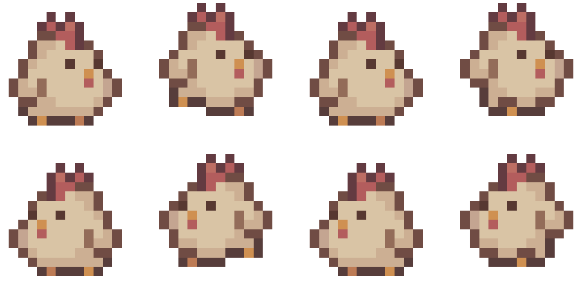
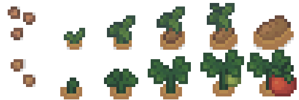

# GDD: A orillas del Duero

Este juego es un proyecto académico de la Asignatura Juegos Serios de la FDI (UCM).

Tiene licencia abierta.

Gameplay: https://www.youtube.com/watch?v=gLOrmUa5QJY&ab_channel=DAVIDCASIANOFLORES

## Índice

1. [Descripción](#desc)
1. [Aspectos generales](#aspG)
    1. [Contexto de uso](#contUso)
1. [Menús y modos de juego](#menuMod)
1. [Jugabilidad](#jug)
    1. [Mecánica](#mec)
    1. [Dinámica](#din)
    1. [Estética](#est)
1. [Contenido](#cont)
    1. [Historia](#hist)
    1. [Personajes](#pers)
    1. [Objetos](#obj)
1. [Referencias](#ref)

# Descripción 

"A orillas del Duero" es un juego de gestión de recursos de un solo jugador, donde se tomará el rol de un granjero que vive en un pueblo al borde del abandono. Durante las semanas en las que transcurre la historia nuestro granjero intentará vivir su vida gestionando su economía. En el proceso ocurrirán diversos eventos, que obstaculizan la fácil gestión de sus recursos, colocando al jugador en situaciones donde deberá tomar decisiones. Estas decisiones se traducen a tareas que gastarán una porción de tiempo. El tiempo será limitado, lo gastarás durante la semana realizando tareas y se te reiniciará al comienzo de la siguiente.  Nosotros como jugadores deberemos intentar aguantar la mayor cantidad de semanas, sin embargo nos enfrentamos a una fuerza fuera del control de nuestro personaje, por lo que antes o después acabaremos perdiendo la partida.

# Aspectos generales 

Queremos ofrecer una experiencia reflexiva donde el jugador aprenderá acerca de una forma de vida que normalmente pasa desapercibida por la mayor parte de la población, sobre todo por la gente que vive en grandes ciudades como Madrid. La vista del videojuego será cenital o aérea mostrando así la granja de nuestro jugador desde el cielo. 
Los controles no irán más allá del uso del ratón. El jugador clickará en las diferentes zonas del mapa, desplegando así menús donde se ofrecerán diferentes opciones que el jugador podrá realizar. Estas opciones en su mayoría serán tareas que gastarán puntos de acción. Estos puntos de acción representan el tiempo que tiene un granjero a lo largo de la semana. La partida finaliza cuando el jugador se queda sin dinero.
Este juego quiere enseñar al jugador lo duro que es vivir el día a día en una granja particular y criticar duramente las formas en las que ciertas instituciones y empresas parecen dispuestas a terminar con esta forma de vida. No intenta dar la solución al problema solo visualizarlo. 

## i. Contexto de uso 

Los principales interesados en dar a conocer el tema que tratamos y que quieran que la gente pruebe el juego son los trabajadores del campo de los pueblos pequeños. Por ejemplo, una asociación de algún pueblo pequeño de España, que busque concienciar a la gente sobre estos problemas y que luchen porque las autoridades hagan cambios por unas mejores condiciones, podrían proponer a gente joven de las ciudades que jueguen a nuestro juego para dar a conocer la situación en la que se encuentran.

# Menús y modos de juego 

Los menús de nuestro juego son: 

1. Menú de inicio: integrará las siguientes opciones:

    * Jugar: comenzará el juego. 

    * Salir: terminas el programa y sales del juego.

2. Menú de pausa: en el juego podrás pulsar ESC o clickar sobre la tuerca de ajustes de la esquina superior derecha y el juego se pausa ofreciendo las siguientes opciones. 

    * Continuar: quitar la pausa y continuar con el juego.

    * Salir: terminas el programa y sales del juego.

Estética de los menús: botones con detalles rústicos y materiales de tablones. Los fondos verdes y azules mezclando el cielo con el campo.

## i. Configuración 

En el juego no hay ninguna opción configurable.

## ii. Interfaz y control 

* __Controles__: todo el Input va a ser a través del ratón clicando en diferentes partes del mapa de la granja y en las diferentes opciones que despliegue cada zona u objeto con la que interactúas. Al clickar sobre cada parcela de la granja, aparecerá una ventana emergente con una imagen que represente su estado actual (y que le dará al jugador la información necesaria para saber qué necesita en ese momento) y la lista de tareas que se puede realizar allí. Si situamos el ratón sobre las tareas, veremos una descripción más detallada de la misma que especifica qué produce, qué necesita para ser realizada y el tiempo que consume. Si clickamos sobre el botón realizaremos la tarea.

* __Interfaz__: en la parte superior de la pantalla encontraremos los contadores de dinero, número de horas restantes de trabajo de la semana y el número de semanas actual en el que nos encontramos. En la parte central derecha tenemos el botón de "siguiente semana" (equivalente a pasar de turno en los juegos de estrategia) y en la esquina superior izquierda encontraremos el botón que abre el inventario. Al clickar este último, se abrirá una ventana emergente con todos los objetos que tenemos actualmente, los cuales pueden ser vendidos o empleados en la realización de alguna otra tarea. Por último, en la esquina superior derecha tendremos el botón de ajustes, el cual abrirá una ventana con los botones para salir al menú principal y reanudar la partida.

# Jugabilidad 

## i. Mecánica 

El jugador tendrá una vista aérea de su granja. Al tratarse de un juego de gestión de recursos y estrategia, el jugador no controlará a ningún personaje, sino que interactuará con el entorno mediante clicks de ratón. El jugador podrá:

* __Realizar tareas__: cuando el jugador haga click sobre cada estructura o parcela de su granja podrá ver las tareas que se permiten realizar en ella, además de una imagen que represente el estado actual de la misma. Se mostrarán tanto las tareas que necesitan realizarse actualmente como las que no, por lo que el jugador deberá decidir cuáles son las más prioritarias. La tarea se realizará haciendo click en su botón correspondiente. Algunas tareas consumirán recursos mientras que otras los producirán. Todas consumen acciones. Cada semana habrá nuevas tareas que necesitan ser realizadas. Las que no se realicen en esa semana aparecerán también a la semana siguiente. Aparecen tanto las tareas que necesitan ser realizadas como las que no, por lo que el jugador deberá analizar a partir de la imagen informativa de la parcela qué tarea necesita ser realizada.

* __Vender objetos__: el jugador podrá vender por dinero los productos que obtenga de las tareas.

* __Reaccionar a eventos__: los eventos son sucesos que cambian el estado actual de la partida y obliga al jugador a tomar una decisión. Algunos tendrán lugar en una semana concreta ya que son importantes para el desarrollo de la partida, mientras que otros surgirán de manera aleatoria para introducir variedad al juego. Los eventos fijos tendrán lugar al comienzo de la semana, momento en el que se le informará al jugador en qué consiste exactamente. Por ejemplo, al comienzo de la semana 5 se
le informa al jugador de que un nuevo impuesto ha entrado en vigor, de manera que, en adelante, se le cobrará la cantidad correspondiente con una determinada frecuencia. Por el contrario, los eventos aleatorios pueden tener lugar al comienzo o durante la semana. Por ejemplo, un desastre natural tendrá lugar al inicio de una semana aleatoria, informando al jugador de una manera similar a los eventos fijos, mientras que, transcurridas 6 horas de trabajo de una semana aleatoria, puede aparecer un vecino que quiera comprar algún producto a un buen precio.

* __Siguiente semana__: equivalente al botón de pasar de turno en los juegos de estrategia. Terminará la semana y se pasará a la siguiente. No será necesario que el jugador haya gastado todas las horas de esa semana para pasar a la siguiente, pero es recomendable que maximice las tareas que haga cada una de ellas.

* __Paso de estaciones__: cada 8 semanas tendrá lugar el ciclo de estaciones entre primavera, verano, otoño e invierno. La estación actual tiene implicaciones en la recogida de la cosecha (habrá verduras exclusivas de cada estación) y en algunos eventos que tienen lugar en una estación específica (como las lluvias o los incendios).

### Recursos: 
Los recursos que deberá gestionar el jugador son:

* __Dinero__: medido en euros, es el principal recurso del jugador y el que determina cómo está yendo su partida. Podrá ganar dinero al vender objetos o a través de algún evento, mientras que perderá dinero al final de algunas semanas según los gastos que tenga, determinado por el mantenimiento de las parcelas, impuestos, etc. Cuando su dinero llegue a cero, la partida acabará.

* __Tiempo__: medido en horas. Representa la cantidad de horas que tiene el jugador cada semana para realizar tareas. Cada tarea tendrá un coste en horas que le sustraerá  al contador de horas restantes de esa semana. Cada semana el jugador contará con 84 horas para realizar tareas. Deberá elegir las tareas que mejor se adapten sin sobrepasar la cantidad límite. También habrá un contador que indique el número de semanas transcurridas desde el inicio de la partida.

* __Objetos__: son el producto de las tareas. Aparecen en un inventario y pueden ser vendidos por dinero. Algunos pueden utilizarse como ingrediente para realizar algunas tareas.

### Parcelas: 
La granja constará de las siguientes __parcelas__, las cuales tendrán cada una de ellas unas tareas específicas:

* __Corral__: contendrá a las gallinas. Las tareas serán: recoger huevos (produce huevos), alimentarlas (necesita pienso), atención médica.

* __Establo de vacas__: contendrá vacas. Tareas: ordeñar (produce leche), alimentarlas (necesita heno, produce abono), llevarlas a pastar (necesita tener un terreno de pasto), atención médica.

* __Establo de ovejas__: contendrá a las ovejas. Tareas: llevarlas a pastar (necesita tener un terreno de pasto), obtener queso, esquilar (produce lana), atención médica.

* __Huerto__: Plantar (necesita semillas), cosechar (produce verduras, si dispones de tractor se reduce el coste de horas), limpiar verduras pochas (si dispones de tractor se reduce el coste de horas).

* __Terreno de pasto__: esta parcela sirve exclusivamente para llevar a pastar a los animales de pastoreo.

* __Casa granjero__: comprar artículos para la granja (en una tienda) y vender el tractor.

### Eventos:
* Fijos: estos eventos aparecerán en momentos espefificos durante el oroceso de la partida:
    
    * __Pagar la Luz/Agua__: cada 4 semanas el jugador deberá tener cierta cantidad de dinero para pagar estos impuestos, en caso de no poder pagarlo el jugador deberá vender alguna de sus pertenencias para alcanzar el precio o perder la granja y provocar un final de partida.
    * __Subida de impuestos__: a lo largo de las semanas el precio que se te exige pagar irá aumentando, por lo que le será más difícil lograr alcanzar las cifras que se le imponen.
      
* Aleatorios: estos eventos tienen la probabilidad de aparecer en algun momento de la partida; sin embargo pueden no verse nunca a lo largo del juego:
  
    * __Animales enfermos/Plaga en los cultivos__: durante el transcurso de las semanas es posible que alguna emergencia ocurra dentro de la granja y en estos eventos el jugador deberá responder a estos llevando a los animales al veterinario o acabando con la plaga (con cierto coste); si el jugador decide ignorarlos o no es capaz de solucionar estos problemas la adquisición del recurso afectado se verá reducida.

    * __Visitas y compra de otros ciudadanos__: durante el juego algunos ciudadanos se pasarán por la granja ya sea para contarte algun consejo, aviso o chisme, este último será la forma en la que el jugador será informado de los cambios y otros sucesos que ocurrirán alrededor de la granja, también para comprarte algún producto por un precio mayor al normal; sin embargo, según pasan las semanas, estas personas irán apareciendo con menos frecuencia.

    * __Lluvia o incendios__: al ocurrir alguno de estos eventos, al jugador solo se le informará de modo que en caso de que llueva pueda ahorrarse regar los cultivos, pero que si ocurre algún incendio se le muestre algún impedimento (no poder llevar a las vacas a pastar) o tenga alguna pérdida (alguna de las instalaciones se quema)
      
    * __Compañía que te compra parte de tus terrenos__: dentro de estos eventos, el jugador deberá decidir si acepta el contrato de la compañía, en el cual le ofrecerán cierta cantidad de dinero pero que a cambio perderá una de las parcelas/fuentes de recursos de las que dispone permanentemente; por lo que tendrá que ver si le conviene aceptarlo.

## i. Dinámica 

Durante las primeras semanas de juego se le explicará al jugador lo que debe hacer y se le marcará un objetivo: desbloquear el tractor. A esto le acompañarán explicaciones sobre cómo jugar a modo de tutorial. Tras conseguir el objetivo marcado inicialmente, el jugador podrá jugar libremente y comenzará la partida como tal.

En este juego no existe una victoria como tal, el jugador está obligado a perder. Esto se debe a la intención educativa que queremos transmitir, de manera que el jugador sea consciente de las dificultades que se encuentran los trabajadores del mundo rural. En concreto, queremos que se sienta en la piel de un granjero que, por muy bien que gestione su granja, está condenado a sufrir pérdidas y, eventualmente, a verse obligado a vender su granja, ya que no es económicamente rentable dedicarse a ello.

Sin embargo, esto no quiere decir que la forma en la que se juegue sea irrelevante. Si el jugador consigue desarrollar una estrategia que le permita maximizar sus ganancias, conseguirá sobrevivir más semanas, por lo que podrá experimentar situaciones que se den exclusivamente en momentos avanzados de la partida, como eventos o diálogos que no aparecen en las primeras semanas del juego.

Nosotros esperamos que el jugador siga una estrategia en la que intente realizar el mayor número de tareas posibles cada semana, intentando gastar siempre las 84 horas/acciones semanales. En caso de que una semana no pueda realizar todas las tareas pendientes, deberá priorizar aquellas que, si son ignoradas, penalizan en mayor medida, como proveer de atención médica a un animal enfermo, pues si no es tratado dejará de producir recursos. Respecto a los productos de las tareas, deberá decidir si venderlos o guardarlos para utilizarlos como ingrediente para realizar otra tarea. Si se decanta por venderlo, obtendrá un beneficio instantáneo, mientras que si lo utiliza para otra tarea podrá obtener un beneficio incluso mayor en un futuro (dependiendo del objeto). Con estas estrategias se espera que el jugador consiga sobrevivir más semanas y así tener una partida más larga y con contenido exclusivo.

## ii.  Estética 

 El juego tendrá una estética pixel art sencilla con detalles rústicos. Estos son algunos ejemplos de sprites:

# Contenido 

## i. Historia 

El abuelo del protagonista, que se está jubilando, le pedirá que se haga cargo de su granja y que consiga algo que él siempre quiso: un tractor amarillo; para así confiarle su granja y que pueda vivir en un ambiente rural, sano y lejos de la ruidosa ciudad. Lo que no va a saber el jugador es que en nuestro juego no habrá un final feliz. Ocupación de terrenos de campo para el uso industrial, abandono de áreas poco pobladas... Estos son solo algunos de los obstáculos que se encontrará nuestro protagonista. Tu misión, lograr mantener tu granja y evitar tener que renunciar a ella.

## ii. Personajes 

*  __Abuelo Saturnino__: el abuelo del protagonista. Le explicará al principio lo que debe hacer.
* __Vecinos__: Doña Paqui y Don Faustino (unos 65 años). Aparecerán esporádicamente en forma de eventos aleatorios.
* __Timoteo__: Un hombre de negocios que querrá comprarle terrenos al jugador. Aparecerán esporádicamente en forma de eventos aleatorios.

## iii. Objetos 

A continuación se detallan los objetos que pueden ser almacenados en el inventario:

| Objetos     | Obtencion                   | Uso                                 |
|-------------|:---------------------------:|------------------------------------:|
| Huevos      | Gallinas corral             | Venta                               |
| Leche       | Vacas (establo)             | Venta                               |
| Queso       | Ovejas (establo)            | Venta                               |
| Lana        | Ovejas (establo)            | Venta                               |
| Pienso      | Compra                      | Alimentar animales (gallinas)       |
| Heno        | Compra                      | Alimentar animales (ovejas y vacas) |
| Abono       | Compra y al alimentar vacas | Fertilizar huerto                   |
| Zanahoria   | Huerto (solo invierno)      | Venta                               |
| Guisantes   | Huerto (solo primavera)     | Venta                               |
| Tomates     | Huerto (solo verano)        | Venta                               |
| Lechuga     | Huerto (solo otoño)         | Venta                               |
| Semillas    | Compra                      | Plantar en el huerto                |

# Referencias 

<u>Stardew Valley</u>

<u>Harvest Moon</u>

<u>Reigns</u>

<u>Sid Meiers's Civilization VI</u>
